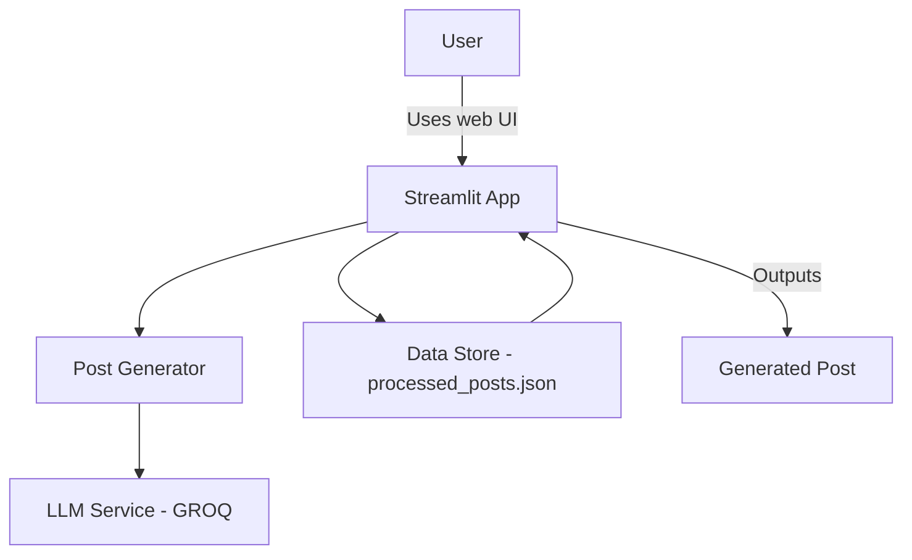
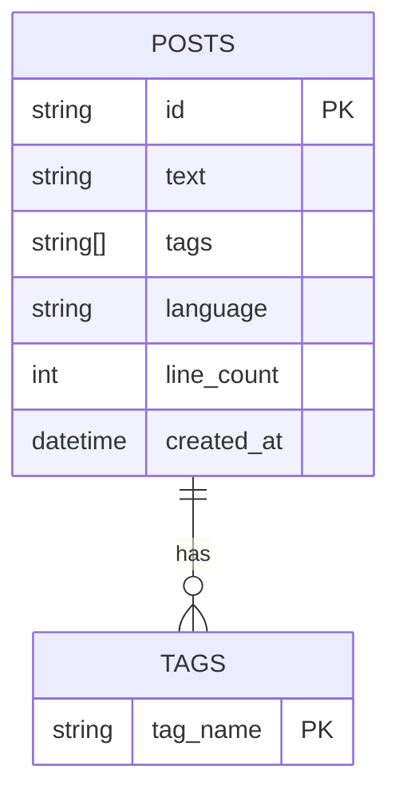
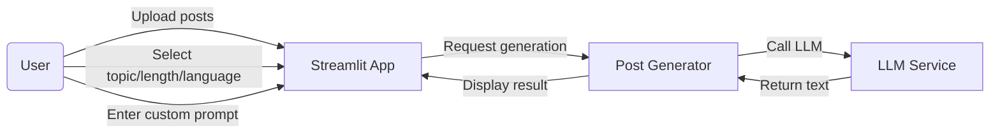

**Project Synopsis — LinkedIn Post Generator (Codebasics)**

Overview
-
This project analyzes a LinkedIn influencer's historical posts to extract topics and writing style, then uses those examples with a large language model (LLM) to generate new LinkedIn posts that match the influencer's tone, language, and preferred length. The app exposes a Streamlit UI for selecting topic, length, language, and an optional custom prompt.

Objectives
-
- Provide an easy UI for generating LinkedIn posts consistent with a user's historical style.
- Use few-shot examples from the user's past posts to guide generation.
- Keep the system runnable locally for demonstration without an external API key (fallback responses when API key not provided).

Key Features
-
- Topic extraction and tag selection from historical posts.
- Few-shot prompt construction using up to two past posts per topic.
- Optional custom prompt field to override base instructions.
- LLM integration via GROQ (langchain_groq) with a configurable model.
- Streamlit-based web UI for interactive generation.

Repository Structure
-
- `main.py` — Streamlit app: UI components for Topic, Length, Language, Custom prompt and Generate button.
- `few_shot.py` — Loads `data/processed_posts.json` into a normalized DataFrame, categorizes length, extracts tags, and supports filtering examples for few-shot.
- `post_generator.py` — Builds prompts (or accepts custom prompt), appends few-shot examples, sanitizes text, and calls the LLM helper.
- `llm_helper.py` — Wrapper around the GROQ client (`langchain_groq.ChatGroq`) with fallback behavior when `GROQ_API_KEY` is missing; model name is configurable via environment variable.
- `preprocess.py` — (project file) contains data-preprocessing logic used to convert raw LinkedIn posts into `processed_posts.json` (tokenization, tags, line_count etc.).
- `data/raw_posts.json` — Raw input posts (example format)
- `data/processed_posts.json` — Processed posts used for few-shot examples.
- `requirements.txt` — Python dependencies.

Technologies and Libraries
-
- Python 3.11 — runtime targeted for compatibility with prebuilt wheels.
- Streamlit — UI framework for the interactive web app.
- pandas — Data handling for post examples and preprocessing.
- langchain / langchain-core — Prompt and LLM integration abstractions.
- langchain_groq / groq — GROQ provider client to call the GROQ LLM service.
- python-dotenv — Load environment variables from `.env` (e.g., `GROQ_API_KEY`).

LLM Model
-
- Default model in the project is set to `llama-3.3-70b-versatile` (configured in `llm_helper.py`).
- The model is configurable via the `GROQ_MODEL` environment variable.
- If `GROQ_API_KEY` is not set, the app provides a friendly fallback message instead of calling the external LLM.

Data Preprocessing
-
Input: `data/raw_posts.json` — raw LinkedIn posts with fields like `text`, `created_at`, `tags` (or extracted hashtags), and metadata.

Common preprocessing steps (performed by `preprocess.py` or similar):

- Load raw posts JSON.
- Clean text: trim whitespace, remove extraneous HTML or control characters, normalize quotes.
- Compute `line_count`: count meaningful lines or sentence separators to decide `Short`/`Medium`/`Long` buckets.
- Extract or normalize `tags` (topics) from hashtags/topics or via simple keyword extraction (the current repo expects a `tags` array per post).
- Detect `language` if not already present (e.g., English vs Hinglish) or map user-provided language labels.
- Save structured JSON in `data/processed_posts.json` compatible with `few_shot.py`.

Few-Shot Example Selection
-
- `FewShotPosts.get_filtered_posts(length, language, tag)` selects posts that match provided `length`, `language`, and `tag`.
- Up to two examples are appended to the prompt to guide the LLM (few-shot learning).

Prompt Construction
-
- If the user supplies a `Custom prompt`, the app uses it as the base and appends up to two few-shot examples (if available).
- Otherwise, `post_generator.get_prompt()` builds a short instruction that includes Topic, Length (human-readable range), Language, and appends examples.
- Prompts are sanitized to remove Unicode surrogate halves and other characters that may break HTTP clients or JSON encoding.

Security & Environment
-
- Place your GROQ API key in a `.env` file as `GROQ_API_KEY=your_key_here`.
- Optionally set `GROQ_MODEL` to override the default. If a model has been decommissioned by the service, set `GROQ_MODEL` to a supported model.
- The app contains a safe fallback when the key is missing so it can be demonstrated offline.

How to Run (local)
-
1. Create a Python 3.11 virtual environment and activate it:

```powershell
py -3.11 -m venv .venv311
.venv311\Scripts\Activate.ps1
```

2. Install dependencies:

```powershell
.venv311\Scripts\python -m pip install --upgrade pip setuptools wheel
.venv311\Scripts\python -m pip install -r requirements.txt
```

3. Create `.env` with your GROQ API key (optional):

```
GROQ_API_KEY=YOUR_KEY
# optional: GROQ_MODEL=llama-3.3-70b-versatile
```

4. Run the Streamlit app:

```powershell
.venv311\Scripts\python -m streamlit run main.py
```

Design Diagrams
-
The diagrams below are provided in Mermaid syntax so you can render them in Markdown viewers that support Mermaid or convert to images for a print synopsis.

DFD Level 0 (High level)



DFD Level 1 (Detailed)

```mermaid
flowchart LR
  subgraph UI
    U[User: upload/select posts, set topic/length/language, custom prompt]
    S[Streamlit App]
  end

  subgraph Backend
    P[Preprocessor (preprocess.py)]
    FSP[FewShotPosts (few_shot.py)]
    PG[Post Generator (post_generator.py)]
    LLM[LLM Service (GROQ)]
    DS[Data (processed_posts.json)]
  end

  U --> S
  S --> P
  P --> DS
  S --> FSP
  FSP --> DS
  S --> PG
  PG --> FSP
  PG --> LLM
  LLM --> PG
  PG --> S
  S --> U
```

ER Diagram (Data Model)



Use Case Diagram (via Mermaid flow)



Component Interaction (sequence summary)
-
1. User selects Topic, Length, Language and optionally enters a Custom Prompt in the UI.
2. The UI asks `FewShotPosts` for examples for the selected topic/length/language.
3. `PostGenerator` builds a prompt (or uses custom prompt), appends up to two examples, and sanitizes the final text.
4. The app invokes the GROQ LLM via `llm_helper.py` and receives generated content.
5. Generated content is shown to the user in the Streamlit UI.

Files and responsibilities (detailed)
-
- `main.py` — Presents three dropdowns (Topic, Length, Language) and a `Custom prompt` textarea. Calls `generate_post()` on button press. Renders returned text with `st.write()`.
- `few_shot.py` — Reads `data/processed_posts.json` into a pandas DataFrame, computes `length` bucket (`Short`, `Medium`, `Long`) from `line_count`, and extracts a unique list of tags for the Topic selector.
- `post_generator.py` — `get_prompt()` constructs the default prompt. `generate_post()` accepts `custom_prompt` optional argument, appends few-shot examples when available, sanitizes text (removes Unicode surrogates), and calls `llm.invoke()`.
- `llm_helper.py` — Wraps the GROQ client and provides fallback behavior when `GROQ_API_KEY` is missing. The model is configurable via `GROQ_MODEL` env var.
- `preprocess.py` — Responsible for converting `raw_posts.json` to standardized structure: {id, text, tags, language, line_count, created_at}.

Evaluation and Limitations
-
- Quality of outputs depends strongly on the quantity and relevance of few-shot examples for the chosen topic.
- Hinglish support is handled as a label; generation remains in Latin script (English letters), and the model may require additional examples to mimic transliterated Hindi.
- The project currently uses simple length buckets derived from `line_count`; more advanced length/structure constraints can be added (token limits, sentence structure guidance).

Future Work
-
- Add automated topic extraction (e.g., using an NLP pipeline: RAKE, YAKE, or transformers-based keywords).
- Improve language detection and transliteration handling for Hinglish.
- Add user authentication and per-user data isolation for multi-user deployments.
- Add a logging/audit trail for generated posts and a rating mechanism to collect feedback.

References
-
- GROQ docs: https://console.groq.com/docs
- Streamlit docs: https://docs.streamlit.io
- LangChain docs: https://langchain.readthedocs.io

Appendix: Example processed post schema (JSON)
-
```
{
  "id": "post_001",
  "text": "Today I learned about the importance of consistent routines...",
  "tags": ["Productivity","Mindset"],
  "language": "English",
  "line_count": 7,
  "created_at": "2024-03-01T10:12:00Z"
}
```

---
